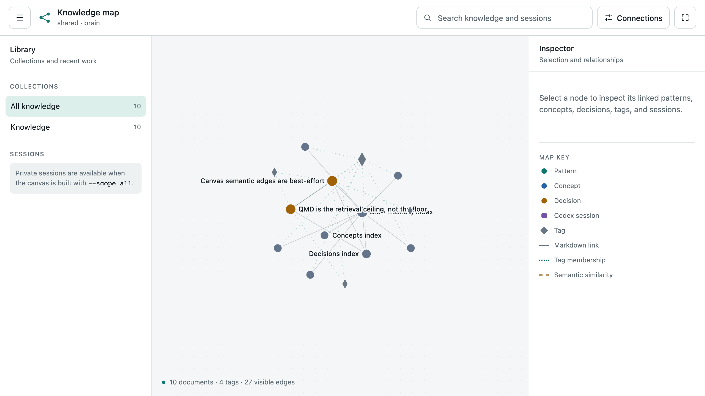

<h1 align="center">
  <picture>
    <source media="(prefers-color-scheme: dark)" srcset="docs/assets/brain-logo-dark.svg">
    
  </picture>
</h1>

<p align="center">
  
</p>

Brain is a portable, cross-repository second brain: LLM agents distill durable
knowledge into structured Markdown, retrieve it across projects, and keep
personal or engagement-specific context local. It adapts [Karpathy's LLM Wiki
pattern](https://gist.github.com/karpathy/442a6bf555914893e9891c11519de94f)
to two explicit operations:

- `$remember [optional lesson]` writes or updates knowledge. The legacy Codex
  alias is `/prompts:remember`.
- `$recall <query>` searches without writing. The legacy Codex alias is
  `/prompts:recall`.

Codex reserves top-level slash commands, so literal `/remember` and `/recall`
cannot be registered. Skills are the supported interface; `/skills` opens their
selector.

## Layout

```text
patterns/              reusable approaches
lessons/               empirical, non-obvious findings
decisions/             decisions and rationale
concepts/              durable concepts and mental models
snippets/              reusable code and procedures
sources/               source-grounded distillations
infra/                 Brain architecture and operating infrastructure
local/                 gitignored private and episodic memory
  notes/                durable personal notes
  projects/<name>/      engagement/project knowledge and checkpoints
  short-mem/            scratch and half-formed notes
meta/tag-taxonomy.md    registered shared tags
MEMORY.md               generated shared index
local/MEMORY.local.md   generated local orientation and index
bin/                    OKF validation, linting, and indexing tools
scripts/                setup, security, command installation, and QA
```

## Public repository boundary

The repository is designed to be published from a normal Git clone. Its public
surface and its machine-local state are deliberately different:

| Layer | Examples | Git policy |
| --- | --- | --- |
| Portable knowledge | `patterns/`, `lessons/`, `decisions/`, `concepts/`, `snippets/`, `sources/`, `infra/` | Tracked and shareable |
| Build and operating source | `bin/`, `scripts/`, `tests/`, `.agents/`, `docs/`, package manifests, `.mcp.json`, `.qmd/index.yml` | Tracked and shareable |
| Generated public navigation | `MEMORY.md`, shared-folder `index.md` files | Tracked and regenerated from public entries |
| Private knowledge | `local/notes/`, `local/projects/`, checkpoints, session catalog, denylist | Ignored; never publish |
| Disposable runtime output | `.qmd/` databases, `.tmp/` canvas, `bin/node_modules/`, caches and virtual environments | Ignored; rebuild locally |

`scripts/guard_shared.py` scans every tracked or non-ignored publication
candidate, not only knowledge entries. It blocks machine-specific home paths,
non-example email addresses, common credential shapes, terms in the private
denylist, and local runtime identity values without printing the private value.
Both `scripts/verify.sh` and the shared-memory auto-commit run this guard.

Before making the repository public, run `python3 scripts/audit_public.py`.
Unlike the ordinary working-tree guard, this pre-publication audit also scans
all reachable Git blobs and commit-author email metadata. It reports locations
without echoing the sensitive value and never rewrites history.

Ignore rules are containment, not permission to store arbitrary secrets. Keep
credentials outside the repository whenever possible, and inspect Git history
and commit-author metadata separately before making an existing repository
public.

## Entry format: OKF-lite

Only `type` is mandatory. `title`, a one-sentence `description`, registered
`tags`, and `date` make retrieval and indexing better.

```markdown
---
type: pattern
title: Prefer a retrieval floor
description: Semantic search should improve recall without becoming required infrastructure.
tags: [knowledge-management, retrieval]
date: 2026-08-27
---

# Prefer a retrieval floor

## Active

Durable claims, decisions, examples, or snippets.

## Superseded

Older claims retained when an update replaces them. Omit when empty.

## Source

Where this knowledge came from.
```

Use file-relative Markdown links between entries. Never silently delete a
superseded claim; move it under `## Superseded` with enough context to explain
the change.

## Materialized artifacts

For a stable, repeatable operation, `$remember` can move code generation and
basic verification into the write path so a later `$recall` does not recreate
the implementation. The schema-backed tracer rejects unsuitable knowledge and
selects Python, JavaScript, or Bash according to the operation's ecosystem.
Mutating artifacts must default to preview, and authoritative revisions update
the existing bundle rather than creating a duplicate.

An artifact bundle contains one canonical searchable Markdown manifest and one
companion script. The manifest records a stable artifact identity, exact
repository-relative invocation, runtime and dependency assumptions, arguments,
environment placeholders, inputs, outputs, exit behavior, applicability,
safety and mutation-default behavior, verification state, and a digest covering the recall-relevant
manifest projection plus the exact payload bytes.

Remember first emits a schema-valid eligibility/language trace, then creates a
schema-valid candidate and payload under ignored `.tmp/`. It finds an existing
artifact by identity and reports looser lexical, applicability, or semantic
matches as ambiguous before preparing without writing knowledge:

```sh
python3 bin/artifact_bundle.py prepare \
  --candidate .tmp/example.json \
  --payload .tmp/example.py \
  --manifest snippets/example.md \
  --evidence-output .tmp/example.preliminary-evidence.json
```

Preparation performs a non-executing language syntax check but does not run the payload.
Three independent, schema-valid challenge reviews must agree on that exact
bundle first. A deterministic reducer rejects stale or mismatched
contributions, preserves blockers, and caps repair at three revisions. After
agreement, the artifact verifier may run the declared non-mutating help,
focused, and representative checks and emit content-bound evidence. Explicit
human approval binds the bundle digest, evidence digest, and review revision.
Reviewer agreement never manufactures empirical verification. Any covered
change needs fresh review, verification, and acceptance.

For an exact artifact match, recall uses the read-only projector:

```sh
python3 bin/artifact_bundle.py recall --manifest snippets/example.md
```

Its default output is exactly the stored payload path, invocation, and
verification state. `--show-code` returns the stored payload bytes unchanged.
The projector checks the bundle digest first and never executes, adapts, or
writes the artifact. Optional language, runtime, and applicability context
returns one incompatibility statement instead of mismatched or adapted code.

The deterministic acceptance corpus uses schema-valid JSON inputs and results:

```sh
python3 scripts/eval_artifacts.py --output /tmp/artifact-eval-result.json
```

It checks eligibility, language choice, complete manifests, safety and privacy,
updates, review/evidence/approval binding, exact minimal recall, offline
read-only behavior, and fail-closed protocol cases. `scripts/verify.sh` runs the
same gate automatically.

## Retrieval

Retrieval is tiered:

1. QMD is the semantic ceiling, exposed to Codex through the `brain-qmd` MCP
   server (`query`, `get`, `multi_get`, and `status`).
2. `rg` over the entire repository is the always-available floor and source of
   truth.
3. Results are merged and ranked, favoring exact metadata matches and durable
   shared knowledge unless local project context is more relevant.

The checked-in `.qmd/index.yml` defines two local collections: `brain` spans
the repository (including gitignored `local/`), while the excluded-by-default
`codex-sessions` collection indexes compact private summaries generated from
Codex JSONL history. `bin/sync_codex_sessions.py` refreshes those summaries
under gitignored `local/session-catalog/`; raw transcripts are never copied
into committed output or embedded wholesale. The session collection is
available to temporal recall and the all-scope canvas, but never participates
in default shared retrieval.

QMD runs locally. Install it with `npm install -g @tobilu/qmd`, then build the
private session catalog and indexes through the repository refresh command:

```sh
scripts/refresh-qmd.sh
scripts/install-qmd-mcp.sh
```

The MCP installer adds a global Codex stdio server whose command is the Brain
wrapper with `mcp`. Codex CLI, the IDE extension, and the desktop app share that
configuration; start a new Codex session after first installation so its tools
are loaded. The wrapper selects the Node version in `.nvmrc` and the Brain's
project-local index. Recall uses MCP for QMD access and still works through the
text-search floor when the server or models are unavailable. If a host's GPU
backend is unstable, QMD documents `QMD_FORCE_CPU=1` as an opt-in fallback.

`scripts/refresh-qmd.sh` is the internal maintenance boundary. It may call the
QMD CLI for `update` and `embed` because QMD's MCP server intentionally exposes
retrieval and status tools, not index mutations. Do not use the CLI for normal
`$recall` or `$remember` retrieval.

## Knowledge canvas

Start the live force-directed view of the shared Brain:

```sh
bin/canvas.py
```

The canvas opens at `http://127.0.0.1:8765/`. It is a local web application, not
a generated working file: tracked `bin/canvas.html` and `bin/canvas.js` are
served directly, and the graph is rebuilt in memory from the local QMD index.
The open page reloads automatically—normally within a second—when either UI
source file or QMD's SQLite/WAL state changes.

The interface has a
collection/session library on the left, the graph in the center, and a
persistent inspector on the right. Click a node to see linked knowledge grouped
by kind; the map key explains the stable colors, shapes, and edge styles.
Double-click a node or use the inspector's primary action to open its source in
VS Code through the editor's registered `vscode://file/` URL handler. The
secondary **Open file** action preserves a default-application fallback. Drag,
pan, zoom, search, filter, or fit the graph as needed. Markdown and the QMD
index remain canonical. Generated navigation files such as `MEMORY.md` and
folder indexes stay searchable but are omitted from the graph so they do not
masquerade as knowledge entries.

The live server never invokes QMD directly. It only reflects state already
present in the local index, so MCP remains the agent retrieval interface and
Brain-owned maintenance remains the index update boundary.

The default view remains shared-only. Use `--scope all` explicitly to include
gitignored local knowledge and the private `codex-sessions` collection; recent
sessions then appear in the left library and connect to knowledge through
best-effort QMD semantic edges.

Useful variants:

```sh
bin/canvas.py --no-open
bin/canvas.py --dry-run
bin/canvas.py --scope all
bin/canvas.py --port 0
bin/canvas.py --collection brain --semantic-threshold 0.65
bin/canvas.py --all-collections --scope all
```

For a deliberately frozen, offline single-file snapshot, opt into export and
choose its location explicitly:

```sh
bin/canvas.py --output local/exports/brain-canvas.html --scope all
```

Exports can contain excerpts and machine-local source paths. Keep private or
all-scope exports under ignored `local/` storage and never publish them.

Run `npm install --prefix bin` once to install the pinned D3 asset. D3 is
inlined into live responses and explicit exports, so the canvas does not depend
on a CDN. Semantic edges read QMD's internal SQLite vector layout best-effort;
if that layout is missing or changes, link and tag edges still render.

## Setup

```sh
scripts/install-codex-commands.sh
npm install --prefix bin
scripts/verify.sh
```

The installer makes the two checked-in skills available across repositories and
adds deprecated custom-prompt aliases for Codex CLI/IDE compatibility. It does
not overwrite existing commands.

`$remember` runs `scripts/auto-commit.sh` for shared knowledge. This is the
owner-sanctioned exception to ordinary commit discipline. The script regenerates
indexes, validates artifact bundle closure, runs the repository-owned
publication and routing guard, and commits only allowlisted shared paths without
pushing. It uses an isolated Git index so unrelated staged work is preserved and
cannot leak into the memory commit. A validation, guard, hook, or commit failure
leaves the real index untouched.

## License

Brain is released under the [Apache License 2.0](LICENSE), identified by the
SPDX expression `Apache-2.0`. See [NOTICE](NOTICE) for project attribution and
[THIRD_PARTY_NOTICES.md](THIRD_PARTY_NOTICES.md) for D3.js terms. Live canvas
responses and explicit exports embed the D3.js license notice alongside the
inlined library.
